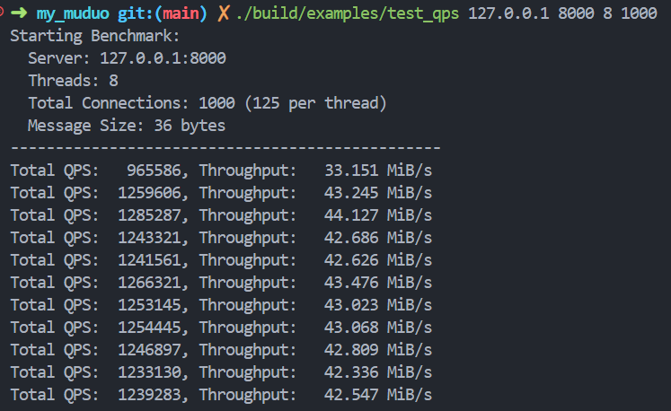
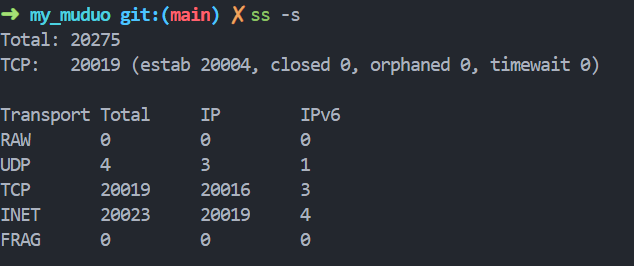

# MyMuduo - A High-Performance C++ Network Library

[](LICENSE)
[](https://en.cppreference.com/)
[]()
[]()

> **核心亮点**: 在单机环境（WSL2）下，Echo Ping-Pong 压测 **QPS 突破 120 万**，吞吐量达 **40 MB/s**。

## 📖 项目简介 (Introduction)

**MyMuduo** 是一个基于 **Reactor 模型** 的高性能 C++11 网络库。

本项目是陈硕先生 `muduo` 网络库的核心重构与实现。我摒弃了原库中对 Boost 库的依赖，完全使用 **现代 C++ (C++11/14)** 特性（如 `std::function`, `std::shared_ptr`, `std::thread` 等）进行了重写。

该项目旨在深入探索高性能网络编程的核心原理，包括非阻塞 I/O、事件驱动循环、多线程模型以及高并发场景下的资源管理。它不仅仅是一个玩具项目，更是一个具备**工业级架构**、支持**高并发**、**断线重连**和**异步日志**的完整网络解决方案。

## 🚀 核心特性 (Key Features)

* **底层模型**: 采用 **Epoll LT** (水平触发) + **非阻塞 I/O** (Non-blocking I/O)，这是目前 Linux 下最成熟的高并发处理方案。
* **线程模型**: 实现了 **Multi-Reactors** (主从 Reactor) + **One Loop Per Thread** 模型。
    * **MainLoop**: 主线程只负责 `accept` 新连接，处理高优先级的连接建立。
    * **SubLoops**: 固定数量的 I/O 子线程池，通过**轮询 (Round-Robin)** 策略分担已连接 Socket 的读写事件，充分利用多核 CPU。
* **并发优化**:
    * 利用 Linux 特有的 **`eventfd`** 实现高效的线程间唤醒与通信，替代了传统的管道/Socket对。
    * 实现了基于**生产者-消费者模型**的任务队列，支持跨线程任务派发 (`runInLoop`/`queueInLoop`)，将 I/O 操作严格限制在所属线程内，实现了**无锁化 (Lock-free)** 的 I/O 处理路径。
* **内存与资源管理**:
    * 全面遵循 **RAII** (资源获取即初始化) 原则管理 Socket、Thread 等资源，杜绝内存泄漏。
    * 巧妙利用 `std::shared_ptr` 和 `std::weak_ptr` (结合 **`tie` 机制**)，解决了多线程环境下对象生命周期模糊导致的**竞态条件** (Race Condition) 和悬空指针问题。
* **高性能组件**:
    * **Buffer**: 实现了应用层缓冲区，利用 `readv` 进行分散读 (Scatter Read)，在栈上分配临时空间，最大限度减少系统调用 (`read`) 次数。
    * **AsyncLogging**: 实现了**双缓冲区** (Double Buffering) 技术的前端/后端分离异步日志，将磁盘 I/O 从业务线程中剥离，确保业务处理的低延迟。
    * **TimerQueue**: 基于 `timerfd` 和 `std::set` 实现了高精度的定时器队列，支持一次性和周期性任务。

## 📊 性能测试 (Benchmark)

本项目经过了严苛的压力测试。使用 Ping-Pong 模式（客户端发送数据 -> 服务器回显 -> 客户端收到立刻再次发送）验证吞吐量与并发能力。

### 测试环境
* **OS**: Ubuntu 22.04 (WSL2 on Windows 11)
* **CPU**: Intel Core i9-13900H (14 Cores, 20 Threads)
* **Compiler**: g++ 11.4.0 (Optimization: -O3)
* **Memory**: 8GB (WSL limit)

### 测试结果
在开启 **8 个并发客户端进程**（模拟 1000+ 并发连接），每个进程疯狂发送 36 bytes 消息的场景下，服务器表现如下：

| Metric | Result |
| :--- | :--- |
| **Total QPS** | **1,200,000+** |
| **Throughput** | **40 MiB/s+** |

> **压测截图**:
>
> 
> *（图：8进程并发压测，单机 QPS 突破 120 万）*

**(注：测试禁用了日志输出以模拟生产环境性能)**
### 📉 并发与资源消耗 (Concurrency & Resources)

除了高吞吐量，本项目还经过了 C10K/C20K (2万并发) 稳定性测试，验证了在高并发场景下极低的资源占用。

**测试环境**:
* Client: Python 脚本模拟 20,000 个空闲 TCP 连接。
* Server: WSL2 (Ubuntu 22.04), Limit `ulimit -n 65535`。

**测试结果**:
* **并发连接数**: 成功维持 **20,000+** 个同时在线连接。
* **内存占用**:
    * 初始 RSS: ~3.6 MB
    * 20k 连接后 RSS: ~33.3 MB
    * **平均每连接消耗**: **~1.5 KB** (应用层内存)

> **数据证据**:
>
> 1. **连接数验证** (`ss -s` 显示 20k+ established):
> 
>
> 2. **内存消耗监控** (RSS 从 3680KB 涨至 34080KB):
> 


## 🏗️ 系统架构 (Architecture)

MyMuduo 采用典型的 **主从 Reactor 多线程架构**：

1.  **TcpServer** 作为外观 (Facade)，管理 `Acceptor` 和 `EventLoopThreadPool`。
2.  **Acceptor** 运行在 `MainLoop` 中，专门监听新连接。
3.  新连接建立后，封装为 **TcpConnection**，并通过轮询算法派发给某个 **SubLoop** (I/O 线程)。
4.  **TcpConnection** 在其所属的 `SubLoop` 中处理所有读写事件，利用 **Channel** 和 **Poller** 与 `epoll` 内核交互。


## 🛠️ 构建与运行 (Build & Run)

### 环境要求
* Linux Kernel version >= 2.6.28 (支持 `timerfd`, `eventfd`)
* CMake >= 3.0
* GCC >= 4.8 (支持 C++11)

### 编译步骤

```bash
# 1. 克隆仓库
git clone https://github.com/ydzzz0096/my_muduo.git
cd my_muduo

# 2. 创建构建目录
mkdir build && cd build

# 3. 编译 (推荐使用 Release 模式以获得最佳性能)
cmake -DCMAKE_BUILD_TYPE=Release ..
make -j4