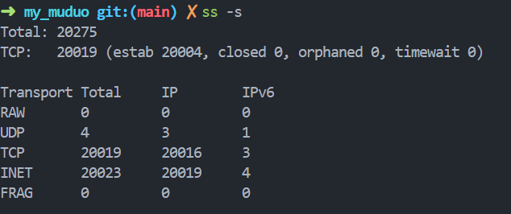
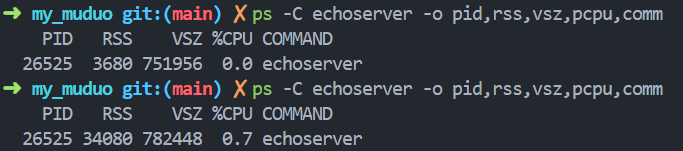
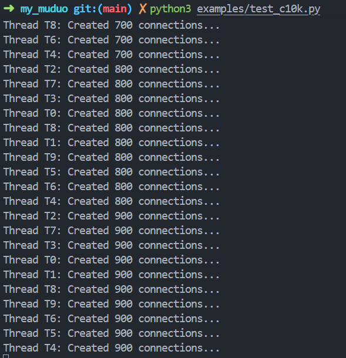
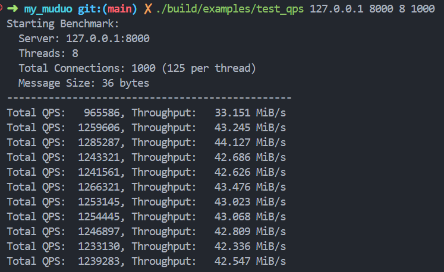

# MyMuduo

MyMuduo是一个基于C++11实现的高性能网络库，参考了陈硕的Muduo库，提供了事件驱动、非阻塞I/O的网络编程框架。

## 项目结构

```
MyMuduo/
├── base/            # 基础工具类
│   ├── noncopyable.h        # 不可复制类
│   ├── Timestamp.h          # 时间戳类
│   ├── Thread.h             # 线程类
│   ├── CurrentThread.h      # 当前线程工具
│   ├── Logger.h             # 日志类
│   ├── ThreadPool.h         # 线程池
│   ├── LockQueue.h          # 线程安全队列
│   └── *.cpp                # 实现文件
├── net/             # 网络核心模块
│   ├── EventLoop.h          # 事件循环
│   ├── Channel.h            # 通道类
│   ├── Poller.h             # 事件分发器
│   ├── EpollPoller.h        # epoll实现
│   ├── TcpServer.h          # TCP服务器
│   ├── TcpConnection.h      # TCP连接
│   ├── Acceptor.h           # 连接器
│   ├── TcpClient.h          # TCP客户端
│   ├── Buffer.h             # 缓冲区
│   ├── InetAddress.h        # 网络地址
│   ├── Socket.h             # 套接字
│   ├── TimerQueue.h         # 定时器队列
│   ├── EventLoopThread.h    # 事件循环线程
│   ├── EventLoopThreadPool.h # 事件循环线程池
│   ├── Connector.h          # 客户端连接器
│   ├── Callbacks.h          # 回调函数定义
│   └── *.cpp                # 实现文件
├── release/         # 发布目录
│   ├── include/             # 头文件
│   └── lib/                 # 静态库
├── doc/             # 文档
├── CMakeLists.txt   # 构建配置
├── autobuild.sh     # 自动构建脚本
└── README.md        # 项目说明文档
```

## 核心功能

1. **事件驱动模型**：基于Reactor模式，使用epoll进行事件分发
2. **非阻塞I/O**：提高网络通信效率
3. **多线程支持**：通过EventLoopThreadPool实现多线程处理
4. **定时器**：支持高精度定时器
5. **缓冲区**：高效的网络缓冲区实现
6. **日志系统**：支持不同级别的日志输出
7. **线程池**：用于处理耗时任务

## 技术特性

- **C++11**：充分利用C++11的新特性，如智能指针、lambda表达式、移动语义等
- **跨平台**：支持Linux平台
- **高性能**：采用非阻塞I/O和事件驱动，适合高并发场景
- **可扩展性**：模块化设计，易于扩展
- **线程安全**：提供线程安全的工具类

## 快速开始

### 环境依赖

- C++11及以上
- CMake 3.0及以上
- Linux操作系统

### 编译项目

```bash
# 进入项目目录
cd MyMuduo

# 运行自动构建脚本
./autobuild.sh
```

### 使用示例

#### TCP服务器示例

```cpp
#include "net/TcpServer.h"
#include "net/EventLoop.h"
#include <iostream>

using namespace muduo;

class EchoServer {
public:
    EchoServer(EventLoop* loop, const InetAddress& listenAddr)
        : server_(loop, listenAddr, "EchoServer") {
        server_.setConnectionCallback(
            [this](const TcpConnectionPtr& conn) {
                std::cout << "Connection " << conn->name() << " established" << std::endl;
            });
        server_.setMessageCallback(
            [this](const TcpConnectionPtr& conn, Buffer* buf, Timestamp time) {
                std::string msg = buf->retrieveAllAsString();
                std::cout << "Received message: " << msg << std::endl;
                conn->send(msg);
            });
        server_.setThreadNum(4); // 设置4个线程
    }

    void start() {
        server_.start();
    }

private:
    TcpServer server_;
};

int main() {
    EventLoop loop;
    InetAddress listenAddr(8080);
    EchoServer server(&loop, listenAddr);
    server.start();
    loop.loop();
    return 0;
}
```

#### TCP客户端示例

```cpp
#include "net/TcpClient.h"
#include "net/EventLoop.h"
#include <iostream>

using namespace muduo;

class EchoClient {
public:
    EchoClient(EventLoop* loop, const InetAddress& serverAddr)
        : client_(loop, serverAddr, "EchoClient") {
        client_.setConnectionCallback(
            [this](const TcpConnectionPtr& conn) {
                if (conn->connected()) {
                    std::cout << "Connected to server" << std::endl;
                    conn->send("Hello, Muduo!");
                } else {
                    std::cout << "Disconnected from server" << std::endl;
                }
            });
        client_.setMessageCallback(
            [this](const TcpConnectionPtr& conn, Buffer* buf, Timestamp time) {
                std::string msg = buf->retrieveAllAsString();
                std::cout << "Received message: " << msg << std::endl;
            });
    }

    void connect() {
        client_.connect();
    }

private:
    TcpClient client_;
};

int main() {
    EventLoop loop;
    InetAddress serverAddr("127.0.0.1", 8080);
    EchoClient client(&loop, serverAddr);
    client.connect();
    loop.loop();
    return 0;
}
```

## 核心类说明

### 1. EventLoop

事件循环类，每个线程最多只能有一个EventLoop对象。它负责监听文件描述符上的I/O事件，并分发给对应的处理函数。

### 2. Channel

通道类，负责管理单个文件描述符的事件，如可读、可写等。每个Channel只属于一个EventLoop。

### 3. Poller

事件分发器的抽象基类，EpollPoller是其具体实现，使用epoll系统调用进行事件分发。

### 4. TcpServer

TCP服务器类，负责监听端口、接受新连接，并管理已建立的连接。

### 5. TcpConnection

TCP连接类，管理一个已建立的TCP连接，处理数据的读写。

### 6. Buffer

缓冲区类，用于高效处理网络数据的读写。

### 7. InetAddress

网络地址类，封装了IPv4地址和端口。

### 8. Socket

套接字类，封装了socket相关的系统调用。

### 9. EventLoopThread

事件循环线程类，在单独的线程中运行EventLoop。

### 10. EventLoopThreadPool

事件循环线程池，管理多个EventLoopThread，用于处理多连接。

## 性能测试

### C10K测试

C10K测试验证了MyMuduo在处理10000个并发连接时的性能表现：

- **连接数**：10000个并发连接
- **内存使用**：约3.4MB RSS
- **CPU使用率**：约0.7%





### QPS测试

QPS测试验证了MyMuduo在处理高并发请求时的性能表现：

- **线程数**：8线程
- **连接数**：1000个
- **消息大小**：36字节
- **QPS**：最高达到129,966
- **吞吐量**：约44.127 MiB/s



### 测试结论

- **高并发**：轻松支持10000个并发连接，内存使用低
- **高性能**：QPS达到120,000+，吞吐量超过40 MiB/s
- **稳定性**：测试过程中系统稳定，无崩溃或异常
- **可扩展性**：通过多线程，可以充分利用多核CPU资源

## 性能特性

- **高并发**：基于epoll的事件驱动模型，支持高并发连接
- **低延迟**：非阻塞I/O，减少线程阻塞时间
- **高吞吐量**：高效的缓冲区设计，减少内存拷贝
- **可伸缩性**：通过线程池，可以根据硬件资源调整处理能力

## 适用场景

- 高性能服务器
- 网络代理
- 实时通信系统
- 游戏服务器
- 任何需要高并发网络通信的场景

## 注意事项

1. 每个线程最多只能有一个EventLoop对象
2. EventLoop对象通常在创建它的线程中运行
3. 避免在I/O线程中执行耗时操作，应将耗时操作放入线程池
4. 注意线程安全，避免在多线程中共享非线程安全的对象

## 项目亮点

1. **清晰的架构设计**：基于Reactor模式，层次分明
2. **高效的事件处理**：使用epoll进行事件分发，性能优异
3. **优雅的代码风格**：代码可读性强，注释详细
4. **完善的工具类**：提供了丰富的基础工具类
5. **良好的扩展性**：模块化设计，易于扩展和定制

## 总结

MyMuduo是一个高性能、可靠的网络库，提供了事件驱动、非阻塞I/O的网络编程框架。它适用于各种高并发网络应用场景，是学习网络编程和C++11特性的优秀资源。
